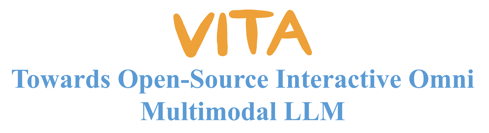
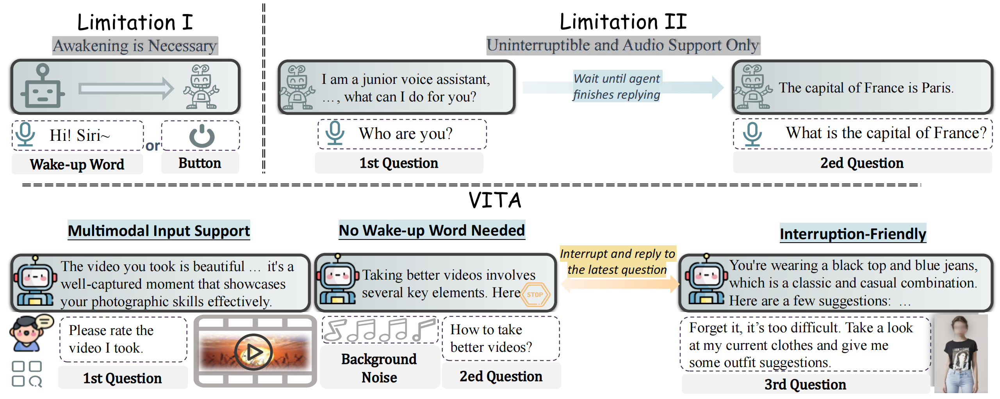
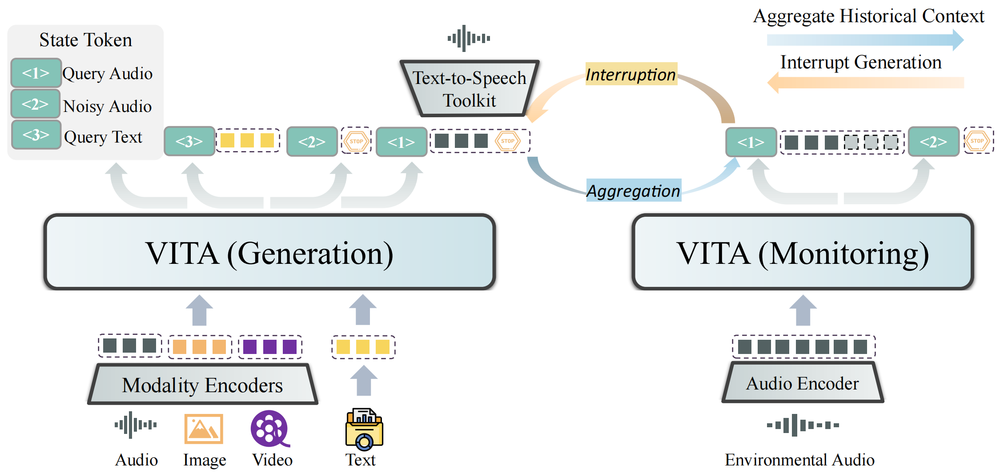
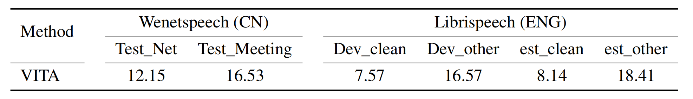
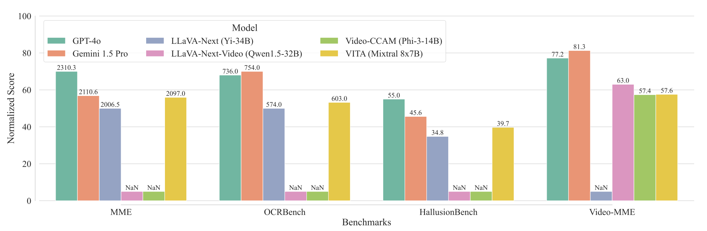
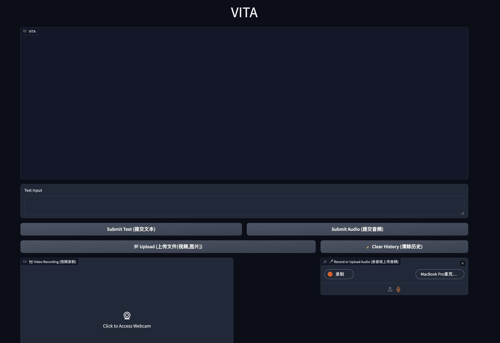
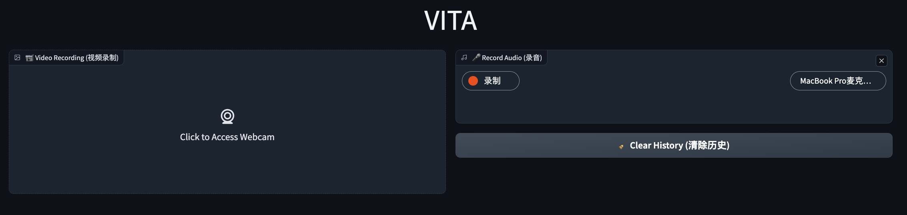

# VITA: Towards Open-Source Interactive Omni Multimodal LLM


<p align="center">
    
</p>

<font size=7><div align='center' > [[🍎 Project Page](https://vita-home.github.io/)] [[📖 arXiv Paper](https://arxiv.org/pdf/2408.05211)] [[🤗 Hugging Face](https://huggingface.co/VITA-MLLM)] [[💬 WeChat (微信)](./asset/wechat.jpg)]</div></font>


---

## 🔥 News
* **`2024.09.06`** 🌟 The training code, deployment code, and model weights **have been released**. Long wait!
* **`2024.08.12`** 🌟 We are very proud to launch VITA, the First-Ever open-source interactive omni multimodal LLM! We have submitted the open-source code, yet it is under review internally. We are moving the process forward as quickly as possible, stay tuned!


## Contents <!-- omit in toc -->


- [VITA Overview](#-vita-overview)
- [Experimental Results](#-experimental-results)
- [Training](#-training)
  - [Requirements and Installation](#requirements-and-installation)
  - [Data Preparation](#data-preparation)
  - [Continual Training](#continual-training)
- [Inference](#-inference)
  - [Quick Start](#quick-start)
  - [Demo](#demo)
    - [Basic Demo](#-basic-demo)
    - [Real-Time Interactive Demo](#-real-time-interactive-demo)


## 👀 VITA Overview
The remarkable multimodal capabilities and interactive experience of GPT-4o underscore their necessity in practical applications, yet open-source models rarely excel in both areas. In this paper, we introduce **VITA**, the first-ever open-source Multimodal Large Language Model (MLLM) adept at simultaneous processing and analysis of **V**ideo, **I**mage, **T**ext, and **A**udio modalities, and meanwhile has an advanced multimodal interactive experience. Our work distinguishes from existing open-source MLLM through **three key features**:

- **Omni Multimodal Understanding**. VITA demonstrates robust foundational capabilities of multilingual, vision, and audio understanding, as evidenced by its strong performance across a range of both unimodal and multimodal benchmarks.  
- **Non-awakening Interaction**. VITA can be activated and respond to user audio questions in the environment without the need for a wake-up word or button. 
- **Audio Interrupt Interaction**. VITA is able to simultaneously track and filter external queries in real-time. This allows users to interrupt the model's generation at any time with new questions, and VITA will respond to the new query accordingly.

<p align="center">
    
</p>

VITA is capable of processing inputs in the form of pure text/audio, as well as video/image combined with text/audio. Besides, two key techniques are adopted to advance the multimodal interactive experience: 
 
 - **State Token**. We set different state tokens for different query inputs. <1> corresponds to the effective query audio, such as “what is the biggest animal in the world?”, for which we expect a response from the model. <2> corresponds to the noisy audio, such as someone in the environment calls me to eat, for which we expect the model not to reply. <3> corresponds to the query text, i.e., the question given by the user in text form. During the training phase, we try to teach the model to automatically distinguish different input queries. During the deployment phase, with <2> we can implement non-awakening interaction. 
 - **Duplex Scheme**. We further introduce a duplex scheme for the audio interrupt interaction. Two models are running at the same time, where the generation model is responsible for handling user queries. When the generation model starts working, the other model monitors the environment. If the user interrupts with another effective audio query, the monitoring model aggregates the historical context to respond to the latest query, while the generation model is paused and tune to monitor, i.e., the two models swap identities.
<p align="center">
    
</p>


## 📈 Experimental Results
- **Comparison of official Mixtral 8x7B Instruct and our trained Mixtral 8x7B**.

<p align="center">
    
</p>


- **Evaluation on ASR tasks.**

<p align="center">
    
</p>

- **Evaluation on image and video understanding.**

<p align="center">
    
</p>


## ⭐ Training
### Requirements and Installation
```
git clone https://github.com/VITA-MLLM/VITA
cd VITA
conda create -n vita python=3.10 -y
conda activate vita
pip install --upgrade pip
pip install -r requirements.txt
pip install flash-attn --no-build-isolation
```

### Data Preparation
- An example json file of the training data:
```
[
    ...
    {
        "set": "sharegpt4",
        "id": "000000000164",
        "conversations": [
            {
                "from": "human",
                "value": "<image>\n<audio>\n"
            },
            {
                "from": "gpt",  // follow the setting of llave, "gpt" is only used to indicate that this is the ground truth of the model output
                "value": "This is a well-organized kitchen with a clean, modern aesthetic. The kitchen features a white countertop against a white wall, creating a bright and airy atmosphere. "
            }
        ],
        "image": "coco/images/train2017/000000000164.jpg",
        "audio": [
            "new_value_dict_0717/output_wavs/f61cf238b7872b4903e1fc15dcb5a50c.wav"
        ]
    },
    ...
]
```

- The `set` field is used to retrieve the image or video folder for data loading. You should add its key-value pair to the `FolderDict` in `vita/config/dataset_config.py`:
```
AudioFolder = ""
FolderDict = {
    #### NaturalCap
    "sharegpt4": "",
}
#### NaturalCap
ShareGPT4V = {"chat_path": ""}
```

- Set the JSON path for `"chat_path"` in the corresponding dictionary in [vita/config/dataset_config.py](./vita/config/dataset_config.py).
- Set the audio folder path for `AudioFolder` in [vita/config/dataset_config.py](./vita/config/dataset_config.py).
- Add the data class in `DataConfig` in [vita/config/__init__.py](./vita/config/__init__.py):
```
from .dataset_config import *

NaturalCap = [ShareGPT4V]

DataConfig = {
    "Pretrain_video": NaturalCap,
}
```


### Continual Training
- Download the required weights: (1) [VITA checkpoint](https://huggingface.co/VITA-MLLM/VITA), (2) [InternViT-300M-448px](https://huggingface.co/OpenGVLab/InternViT-300M-448px), and (3) [Our pretrained audio encoder](https://huggingface.co/VITA-MLLM/VITA) in Stage-2 audio-language alignment (refer to Fig. 3 in the paper).

- Replace the paths in [script/train/finetuneTask_nodes.sh](./script/train/finetuneTask_nodes.sh):
```
    ...
    --model_name_or_path VITA_ckpt \
    ...
    --vision_tower InternViT-300M-448px \
    ...
    --audio_encoder audio-encoder-2wh_zh_en_audioset_Mixtral-8x7B_New-base-tunning \
    ...
```

- Execute the following commands to start the training process:

```
export PYTHONPATH=./
export PYTORCH_CUDA_ALLOC_CONF=expandable_segments:True
OUTPUT_DIR=/mnt/cfs/lhj/videomllm_ckpt/outputs/vita_video_audio
bash script/train/finetuneTask_nodes.sh ${OUTPUT_DIR}
```


## 📐 Inference
### Quick Start
- Text query
```
CUDA_VISIBLE_DEVICES=0,1 python video_audio_demo.py \
    --model_path [vita/path] \
    --image_path asset/vita_log2.png \
    --model_type mixtral-8x7b \
    --conv_mode mixtral_two \
    --question "请描述这张图片。" \
```

- Audio query
```
CUDA_VISIBLE_DEVICES=0,1 python video_audio_demo.py \
    --model_path [vita/path] \
    --image_path asset/vita_log2.png \
    --model_type mixtral-8x7b \
    --conv_mode mixtral_two \
    --audio_path asset/q1.wav
```

-  Noisy audio query
```
CUDA_VISIBLE_DEVICES=0,1 python video_audio_demo.py \
    --model_path [vita/path] \
    --image_path asset/vita_log2.png \
    --model_type mixtral-8x7b \
    --conv_mode mixtral_two \
    --audio_path asset/q2.wav
```


### Demo

We have accelerated the model using [vLLM](https://github.com/vllm-project/vllm). 
Since VITA has not yet been integrated into vLLM, you need to make some modifications to the vLLM code to adapt it for VITA.


```bash
conda create -n vita_demo python==3.10
pip install -r web_demo/web_demo_requirements.txt

# Backup a new weight file
cp -r  VITA_ckpt/ demo_VITA_ckpt/

cd ./web_demo/vllm_tools
cp -rf model_weight_file/*  demo_VITA_ckpt/
cp -rf vllm_file/*  your_anaconda/envs/vita_demo/lib/python3.10/site-packages/vllm/model_executor/models/
```


#### 📍 Basic Demo


<p align="center">
    
</p>

```bash
python -m web_demo.web_ability_demo  demo_VITA_ckpt/
```


#### 📍 Real-Time Interactive Demo

To have a good interactive experience, please pay attention to the following three points:

- **Ensure a high-speed network connection**.
- **Use high-performance GPUs for deployment**. In the demo video, we use 4 Nvidia H20 GPUs.
- **Maintain a quiet environment**.

<p align="center">
    
</p>

To run the real-time interactive demo, you need to make the following preparations:

- Prepare a VAD (Voice Activity Detection) module. 
You can choose to download [silero_vad.onnx](https://github.com/snakers4/silero-vad/tree/v4.0/files) and [silero_vad.jit](https://github.com/snakers4/silero-vad/tree/v4.0/files), and place these files in the *./web_demo/wakeup_and_vad/resource/* directory.

- Prepare a TTS (Text-to-Speech) module and modify the *tts_transform_text* function in [./web_demo/web_interactive_demo.py](./web_demo/web_interactive_demo.py). 
The demo uses a TencentCloud API by default. 
You can register on the [Tencent Cloud](https://cloud.tencent.com/product/tts) and obtain a TTS API, 
then fill in your API key on line 43 of [./web_demo/web_interactive_demo.py](./web_demo/web_interactive_demo.py).
You can also try to use other API or open-source modules.

- For a better real-time interactive experience, you need to set *max_dynamic_patch* to 1 in *demo_VITA_ckpt/config.json*. 
When you run the basic demo, you can set it to the default value of 12 to enhance the model's visual capabilities.

```bash
python -m web_demo.web_interactive_demo
```

## ✒️ Citation

If you find our work helpful for your research, please consider citing our work.   

```bibtex
@article{fu2024vita,
  title={VITA: Towards Open-Source Interactive Omni Multimodal LLM},
  author={Fu, Chaoyou and Lin, Haojia and Long, Zuwei and Shen, Yunhang and Zhao, Meng and Zhang, Yifan and Wang, Xiong and Yin, Di and Ma, Long and Zheng, Xiawu and He, Ran and Ji, Rongrong and Wu, Yunsheng and Shan, Caifeng and Sun, Xing},
  journal={arXiv preprint arXiv:2408},
  year={2024}
}
```

## &#x1F4E3; Statement

VITA is trained on large-scale open-source corpus, and its output has randomness.
Any content generated by VITA does not represent the views of the model developers. We are not responsible for any problems arising from the use, misuse, and dissemination of VITA, including but not limited to public opinion risks and data security issues.

## 📜 Related Works

Explore our related researches:
-  **[Video-MME]** [Video-MME: The First-Ever Comprehensive Evaluation Benchmark of Multi-modal LLMs in Video Analysis](https://github.com/BradyFU/Video-MME) 
-  **[MME]** [MME: A Comprehensive Evaluation Benchmark for Multimodal Large Language Models](https://github.com/BradyFU/Awesome-Multimodal-Large-Language-Models/tree/Evaluation)
-  **[Awesome-MLLM]** [A Survey on Multimodal Large Language Models](https://github.com/BradyFU/Awesome-Multimodal-Large-Language-Models)

## 👍 Acknowledgement
VITA is built with reference to the following outstanding works: [LLaVA-1.5](https://github.com/haotian-liu/LLaVA), [Bunny](https://github.com/BAAI-DCAI/Bunny), [ChatUnivi](https://github.com/PKU-YuanGroup/Chat-UniVi), [InternVL](https://github.com/OpenGVLab/InternVL), [InternViT](https://huggingface.co/OpenGVLab/InternViT-300M-448px), and [Mixtral 8*7B](https://mistral.ai/news/mixtral-of-experts/).
Thanks！

